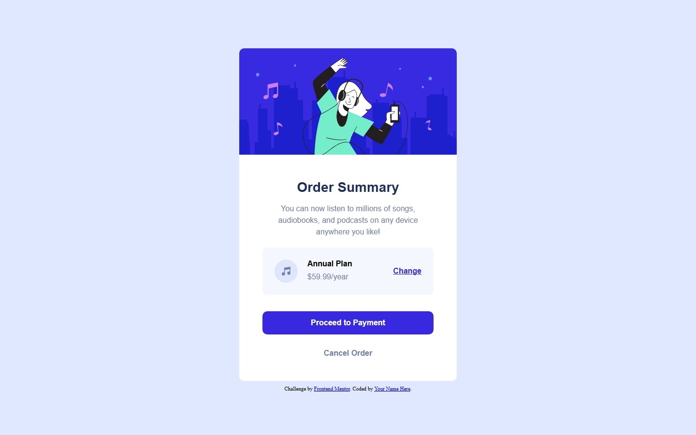
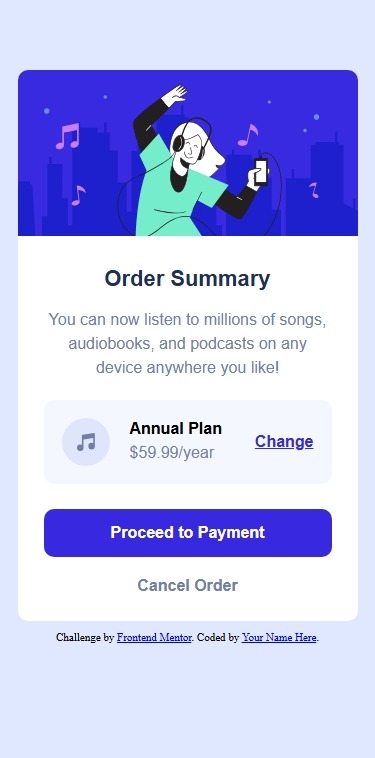

# Frontend Mentor - Order Summary Card 🧾✨

Esta es mi solución al reto [Order Summary Card de Frontend Mentor](https://www.frontendmentor.io/challenges/order-summary-component-QlPmajDUj).  
Un proyecto ideal para practicar maquetación y buenas prácticas en CSS 💻🎯

## 🧩 Resumen

El objetivo del reto fue crear un componente de resumen de pedido con un diseño responsivo, limpio y fiel al diseño original.

## 📸 Captura de pantalla

|descktop|mobile|
|------------|----------|
|||

## 🔗 Enlaces

- 💡 Solución: https://github.com/jeane-th/fm6_componente_resumen_de_orden
- 🌐 Sitio en vivo: https://jeane-th.github.io/m6_componente_resumen_de_orden

## 🛠️ Construido con

- HTML5 semántico 🧱  
- CSS puro 🎨  
- Metodología BEM 🧩  
- Flexbox 📐  
- Diseño responsive 📱  

## 📚 Lo que aprendí

- Aplicar correctamente la metodología **BEM** para organizar mejor el CSS.
- Mejorar la estructura del HTML usando etiquetas semánticas.
- Trabajar layouts con **Flexbox**.
- Crear componentes más ordenados y fáciles de mantener.

## 👩‍💻 Autor

- Frontend Mentor – [@jeane_th](https://github.com/jeane-th)
